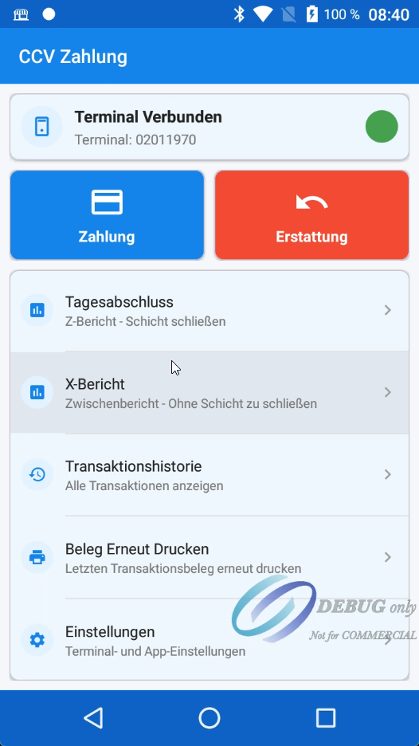
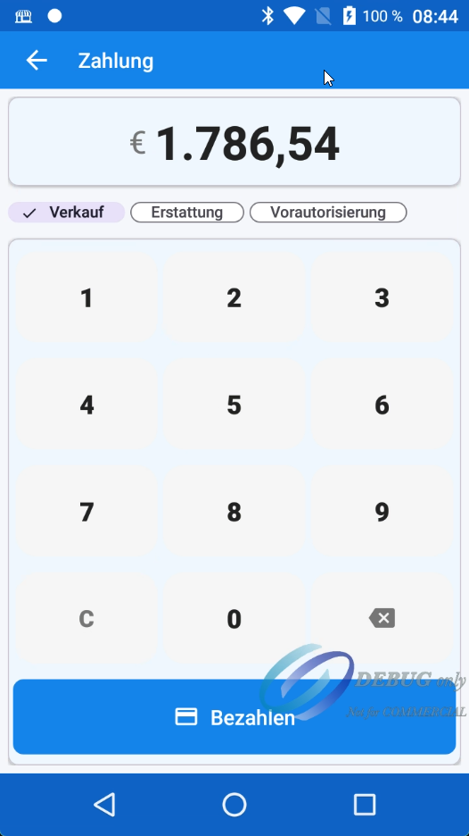
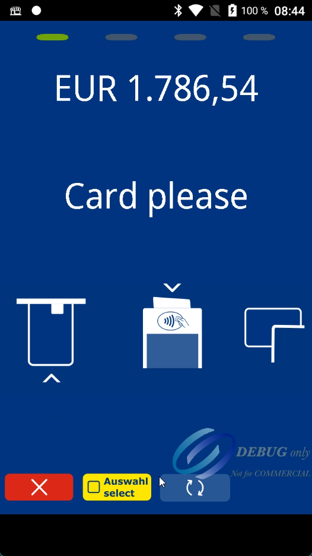
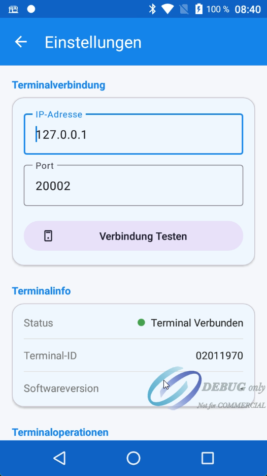
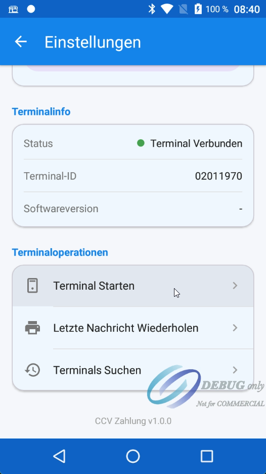

# CCV Ödeme Uygulaması

[](README.md)

> **⚠️ Önemli Uyarı**
>
> Bu proje yalnızca **CCV Debug POS cihazınız** varsa çalışır. Uygulama, test ve geliştirme için debug modu etkin fiziksel bir CCV terminali gerektirir. Debug POS cihazı edinmek için doğrudan CCV ile iletişime geçin.
>
> **İletişim:** [CCV Developer Portal](https://developer.myccv.eu/) | [CCV Website](https://www.ccv.eu/)

---

CCV mAPI SDK kullanarak POS terminal işlemlerini yöneten Android ödeme terminali entegrasyon uygulaması. **Flow tabanlı mimari** kullanır.

## Ekran Görüntüleri

<p align="center">
  
  
  
</p>

<p align="center">
  
  
</p>

## Gereksinimler

- Android SDK 24+ (Android 7.0 Nougat)
- Kotlin 2.0.0
- Gradle 8.14.4
- CCV mAPI SDK 1.33

## Kurulum

1. CCV SDK AAR dosyalarını `libs` klasörüne ekleyin:
   - `api-hardware-1.33.aar`
   - `pi-api-1.33.aar`

2. Projeyi derleyin:
```bash
./gradlew assembleDebug
```

## Mimari

Bu proje, resmi CCV mAPI demo uygulamasına benzer **Flow tabanlı mimari** kullanır:

```
┌─────────────────────────────────────────────────────────────────┐
│                      PaymentActivity                             │
│                    (extends FlowActivity)                        │
├─────────────────────────────────────────────────────────────────┤
│  - Tutar girişi için numpad UI                                   │
│  - Ödeme türü seçimi (Satış, İade, Ön Provizyon)                │
│  - Gerçek zamanlı log görüntüleme                               │
│  - onPaymentSuccess() / onPaymentError() callback'leri          │
└─────────────────────────────────────────────────────────────────┘
                              │
                              ▼
┌─────────────────────────────────────────────────────────────────┐
│                       FlowActivity                               │
│                (implements DelegationFactory)                    │
├─────────────────────────────────────────────────────────────────┤
│  - activeFlow: Flow? (durum yönetimi)                           │
│  - startFlow() / finishFlow() kalıbı                            │
│  - createPaymentDelegate() / createTerminalDelegate()            │
│  - launchPaymentScreen() Android 10+ için                       │
└─────────────────────────────────────────────────────────────────┘
                              │
                              ▼
┌─────────────────────────────────────────────────────────────────┐
│                    OpiDeFlowHandler                              │
│               (implements PaymentFlowHandler)                    │
├─────────────────────────────────────────────────────────────────┤
│  - startPayment() → PaymentService.payment()                     │
│  - startRefund() → PaymentService.payment()                      │
│  - startAbort() → PaymentService.abort()                         │
│  - performPeriodClosing() → TerminalService.periodClosing()      │
└─────────────────────────────────────────────────────────────────┘
```

## Proje Yapısı

```
app/src/main/java/com/example/ccvpayment/
├── CCVPaymentApp.kt              # Application sınıfı (MAPI.initialize)
├── flow/                         # Flow tabanlı mimari
│   ├── Flow.kt                   # Flow enum (PAYMENT, REFUND, vb.)
│   ├── DelegationFactory.kt      # Delegate factory arayüzü
│   ├── PaymentFlowHandler.kt     # Handler arayüzü
│   ├── OpiDeFlowHandler.kt       # OPI-DE protokol implementasyonu
│   └── FlowActivity.kt           # Durum yönetimli base activity
├── helper/
│   ├── PaymentHelper.kt          # Ödeme işlemleri
│   ├── TerminalHelper.kt         # Terminal yönetimi
│   ├── TransactionHelper.kt      # İşlem geçmişi ve raporlar
│   ├── CCVPaymentManager.kt      # Facade sınıfı
│   └── CCVLogger.kt              # Loglama araçları
├── model/
│   └── PaymentModels.kt          # Veri modelleri
└── ui/
    ├── MainActivity.kt           # Ana ekran
    ├── PaymentActivity.kt        # Ödeme ekranı (FlowActivity'den türetilmiş)
    ├── TransactionHistoryActivity.kt
    ├── SettingsActivity.kt
    └── TerminalSettingsActivity.kt
```

---

## Flow Kalıbı

Uygulama, ödeme işlemleri için durum makinesi kalıbı kullanır:

### Flow Durumları
```kotlin
enum class Flow {
    PAYMENT,           // Satış işlemi
    REFUND,            // İade işlemi
    VOID,              // İptal işlemi
    AUTHORISE,         // Ön provizyon
    CAPTURE,           // Provizyon kapama
    STATUS,            // Terminal durumu
    ABORT,             // İşlemi iptal et
    PERIOD_CLOSING,    // Z-Raporu (Gün sonu)
    TRANSACTION_OVERVIEW, // X-Raporu
    // ... diğer flow'lar
}
```

### Flow Yaşam Döngüsü
```kotlin
// 1. Flow aktif mi kontrol et
if (activeFlow == null) {
    // 2. Flow'u başlat
    startFlow(Flow.PAYMENT)

    // 3. Flow handler'ı çağır (delegate'i kaydeder, bloklamaz)
    flowHandler.startPayment(terminal, payment)

    // 4. Ödeme UI'ını aç (Android 10+)
    launchPaymentScreen()
}

// 5. SDK delegate callback'i çağırır
override fun onPaymentSuccess(result) {
    // Başarıyı işle
    finishFlow()  // activeFlow = null yapar
}

// 6. onFlowFinished() çağrılır
override fun onFlowFinished() {
    // UI'ı güncelle, dialog göster
}
```

---

## Mevcut Özellikler

### Ödeme İşlemleri

| Özellik | Flow | Metod |
|---------|------|-------|
| Satış | `Flow.PAYMENT` | `flowHandler.startPayment()` |
| İade | `Flow.REFUND` | `flowHandler.startRefund()` |
| İptal | `Flow.VOID` | `flowHandler.startVoid()` |
| Ön Provizyon | `Flow.AUTHORISE` | `flowHandler.startReservation()` |
| Provizyon Kapama | `Flow.CAPTURE` | `flowHandler.startCapture()` |
| Abort | `Flow.ABORT` | `flowHandler.startAbort()` |

### Terminal İşlemleri

| Özellik | Flow | Metod |
|---------|------|-------|
| Terminal Durumu | `Flow.STATUS` | `flowHandler.startStatus()` |
| Son Fiş | `Flow.RETRIEVE_LAST_TICKET` | `flowHandler.startRetrieveLastTicket()` |
| Son Mesajı Tekrarla | `Flow.REPEAT_LAST_MESSAGE` | `flowHandler.startRepeatLastMessage()` |

### Rapor İşlemleri

| Özellik | Flow | Metod |
|---------|------|-------|
| Gün Sonu (Z-Raporu) | `Flow.PERIOD_CLOSING` | `flowHandler.performPeriodClosing()` |
| X-Raporu | `Flow.TRANSACTION_OVERVIEW` | `flowHandler.getTransactionOverview()` |

---

## Terminal Yapılandırması

```kotlin
// OPI-DE Protokolü (Almanya)
val terminal = ExternalTerminal.builder()
    .ipAddress("127.0.0.1")        // Yerel terminal
    .port(30002)                    // OPI-DE port (varsayılan)
    .compatibilityPort(30007)       // OPI-DE uyumluluk
    .socketMode(SocketMode.SINGLE_SOCKET)
    .terminalType(TerminalType.OPI_DE)
    .workstationId("WORKSTATION_001")
    .languageCode(LanguageCode.EN)
    .build()
```

> **Not:** OPI-DE protokolü varsayılan olarak port **30002** kullanır. Bu, resmi CCV mAPI demo uygulaması konfigürasyonuyla eşleşir.

---

## Kullanım Örneği

### Basit Ödeme
```kotlin
class MyPaymentActivity : FlowActivity() {

    fun startPayment(amount: BigDecimal) {
        if (!isFlowActive()) {
            startFlow(Flow.PAYMENT)

            val payment = buildPayment(Payment.Type.SALE, amount)
            flowHandler.startPayment(getLocalTerminal(), payment)
            launchPaymentScreen()
        }
    }

    override fun onPaymentSuccess(result: PaymentResult) {
        // Ödeme başarılı
        showSuccessDialog(result)
    }

    override fun onPaymentError(errorCode: String, errorMessage: String) {
        // Ödeme başarısız
        showErrorDialog(errorMessage)
    }

    override fun onFlowFinished() {
        // UI durumunu sıfırla
        hideLoading()
    }
}
```

---

## Loglama

Uygulama `CCVLogger` ile kapsamlı loglama içerir:

```kotlin
// İstek loglama
CCVLogger.logPaymentRequest("SALE", terminal, request)

// Yanıt loglama
CCVLogger.logPaymentResponse("SALE", result)

// Olay loglama
CCVLogger.logEvent("FLOW_START", "Starting flow: PAYMENT")

// Hata loglama
CCVLogger.logError("PAYMENT", "DECLINED", "Kart reddedildi")
```

Log çıktı formatı:
```
CCV_REQUEST  >>> SALE REQUEST
CCV_REQUEST  {"timestamp":"09:44:33","operation":"SALE","amount":"10,00 €"}
CCV_EVENT    --- EVENT: TERMINAL_OUTPUT
CCV_EVENT    {"event":"TERMINAL_OUTPUT","data":"Karte bitte"}
CCV_RESPONSE <<< SALE RESPONSE [SUCCESS]
```

---

## Notlar

1. **MAPI.initialize()** Application sınıfında bir kez çağrılmalıdır
2. **singleTask** launchMode MainActivity için gereklidir (ECR callback)
3. Tüm işlemler **async**'tir - delegate'ler callback'leri işler
4. **Flow kalıbı** aynı anda sadece bir işlem olmasını sağlar
5. **finishFlow()** her işlemden sonra çağrılmalıdır (başarılı veya hata)
6. **Port 30002** OPI-DE protokolü için varsayılandır (20002 değil)
7. **finishFlow()** içinde `bringToForeground()` çağrılmamalı - demo uygulaması gibi sadece state sıfırlanmalı

---

## Lisans

Bu proje, CCV terminal cihazlarında kullanım için CCV mAPI SDK lisansı altında geliştirilmiştir.

## Kaynaklar

- [CCV Developer Portal](https://developer.myccv.eu/)
- [Android SDK Dokümantasyonu](https://developer.myccv.eu/documentation/android_sdk/)
- [API Referansı](https://developer.myccv.eu/documentation/android_sdk/api_reference/)
